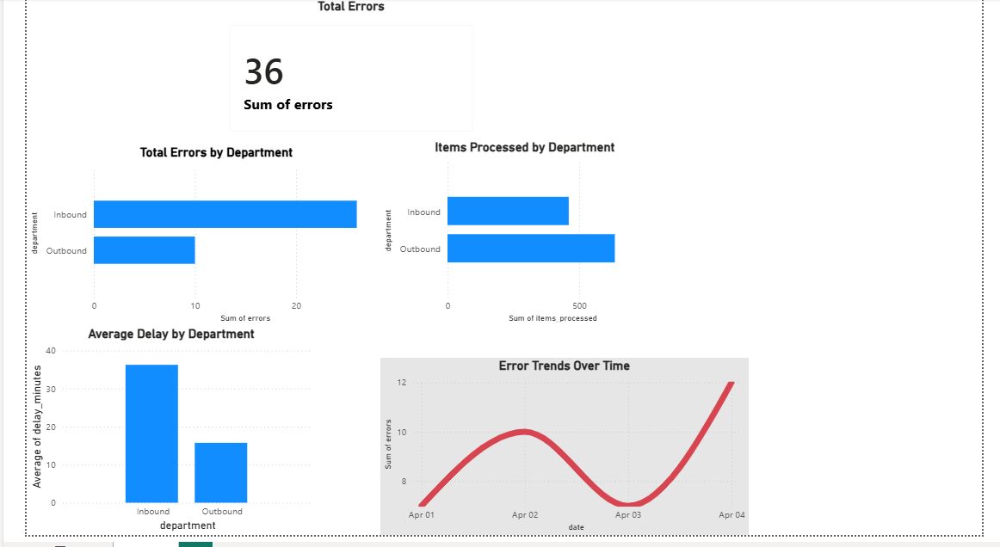

# Warehouse Operations Data Analysis
## Dashboard Preview


## Overview
This project analyzes warehouse operations data using Python to identify inefficiencies, error trends, and performance issues.

## Problem
Warehouse operations often experience delays and errors, but lack clear data insights to identify root causes.

## Solution
Using Python and data analysis techniques, this project:
- Analyzes error rates across departments
- Identifies delays in operations
- Visualizes performance trends

## Tools Used
- Python
- Pandas
- Matplotlib

## Key Insights
- Inbound operations show higher error rates
- Delays are more frequent in inbound processing
- Outbound operations are more efficient
## Business Impact
- Identified inbound process inefficiencies contributing to higher error rates
- Highlighted opportunities to reduce delays and improve throughput
- 
## How to Run
```bash
python analysis.py
